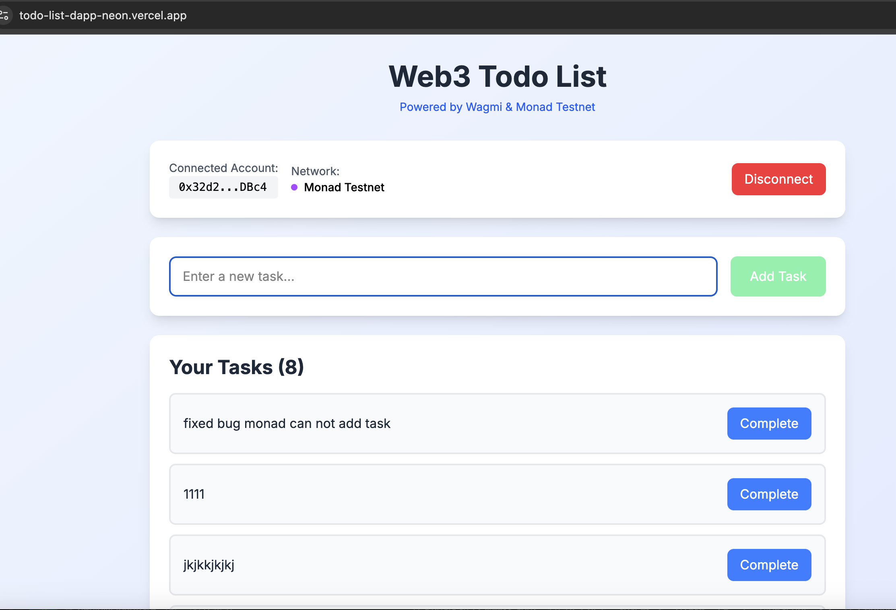
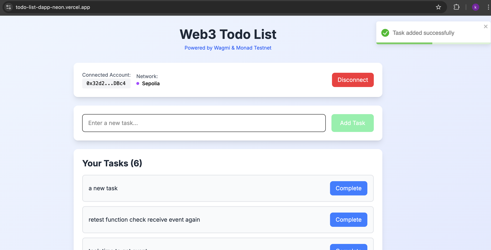
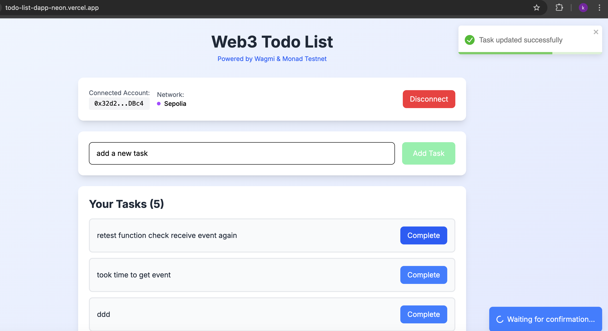

# 🌐 Web3 TodoList DApp Demo

## 📋 Overview

This Web3 TodoList DApp is deployed across **3 testnet networks** to ensure robust testing and demonstrate cross-chain compatibility:

- **Monad Testnet** - High-performance L1 blockchain
- **Polygon Amoy** - Ethereum L2 scaling solution
- **Sepolia** - Ethereum testnet

> ⚠️ **Note**: Since these are testnet networks, you may experience occasional delays or slower performance compared to production networks. This is normal for testnet environments.

## 🌐 Live Demo

Try the application on different platforms:

- **🌐 Vercel**: [https://todo-list-dapp-neon.vercel.app/](https://todo-list-dapp-neon.vercel.app/)
- **⚡ Cloudflare**: [https://web3-todolist-dapp.pages.dev/](https://web3-todolist-dapp.pages.dev/)

## 🔗 Smart Contract Deployments

| Network           | Contract Address                                                                                                                     | Explorer                                             |
| ----------------- | ------------------------------------------------------------------------------------------------------------------------------------ | ---------------------------------------------------- |
| **Monad Testnet** | [`0xA2555F09b2aCC3EabD2feee5e2AC36b5Da066e61`](https://testnet.monadexplorer.com/address/0xA2555F09b2aCC3EabD2feee5e2AC36b5Da066e61) | [Monad Explorer](https://testnet.monadexplorer.com/) |
| **Polygon Amoy**  | [`0x1e2Da01b7bb80FCF011f821D75AEFA3BF48ABf0a`](https://amoy.polygonscan.com/address/0x1e2Da01b7bb80FCF011f821D75AEFA3BF48ABf0a)      | [PolygonScan](https://amoy.polygonscan.com/)         |
| **Sepolia**       | [`0xD4144c1FB6E8d1D068D3E9897B6F233fd34F4B4F`](https://sepolia.etherscan.io/address/0xD4144c1FB6E8d1D068D3E9897B6F233fd34F4B4F)      | [Etherscan](https://sepolia.etherscan.io/)           |

> 💡 **Tip**: Click on any contract address to view all transactions and contract interactions on the respective blockchain explorer.

## 📸 Application Screenshots

### 🔗 Wallet Connection

Connect your MetaMask or other Web3 wallet to get started:

### 📝 Task List View

View all your tasks with their completion status:

### ➕ Adding New Tasks

Add new tasks to your blockchain-based todo list:

### ✅ Task Completion

Mark tasks as complete or incomplete:

## 🛠 Features Demonstrated

- **🔗 Multi-Network Support**: Works seamlessly across 3 different testnet networks
- **⛓️ Blockchain Storage**: All tasks are stored on-chain for true decentralization
- **⚡ Real-time Updates**: Live updates when tasks are added or modified
- **🔐 Wallet Integration**: Secure connection with MetaMask and other Web3 wallets
- **📱 Responsive Design**: Works perfectly on desktop and mobile devices

## 🧪 Testing Strategy

We deployed on **3 different testnet networks** to ensure:

- ✅ **Cross-chain compatibility** - Works on different blockchain architectures
- ✅ **Network reliability** - Robust testing across multiple networks
- ✅ **User experience** - Consistent performance across different platforms
- ✅ **Smart contract security** - Thorough testing before mainnet deployment

> 🎯 **Goal**: This multi-network deployment strategy ensures our DApp is production-ready and can handle real-world usage across different blockchain ecosystems.

---

_Built with ❤️ using Next.js, Wagmi, and Solidity_
